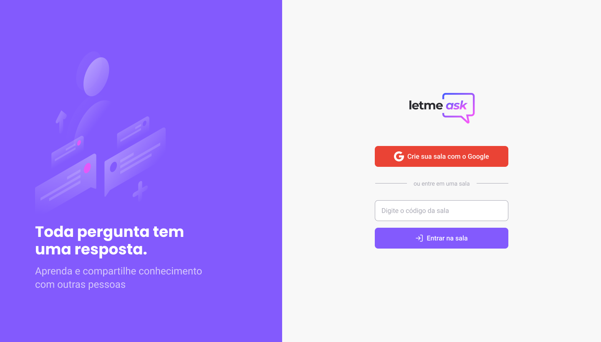
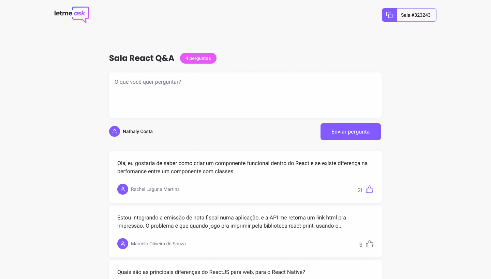

<h1 align="center">
  LetMeAsk
</h1>

  <a href="#-tecnologias">Tecnologias</a>&nbsp;&nbsp;&nbsp;|&nbsp;&nbsp;&nbsp;
  <a href="#-projeto">Projeto</a>&nbsp;&nbsp;&nbsp;|&nbsp;&nbsp;&nbsp;
  <a href="#-layout">Layout</a>&nbsp;&nbsp;&nbsp;|&nbsp;&nbsp;&nbsp;
  <a href="#-como-executar">Como executar</a>&nbsp;&nbsp;&nbsp;|&nbsp;&nbsp;&nbsp;
  <a href="#-licença">Licença</a>

  

## Features

- [x] Tela de Login com o google/auth firebase
- [x] Criar perguntas com o realDataBase do firebase
- [x] Tela de criação da sala após auth.
- [x] Tela da sala - visão de outros usuários.
- [x] Tela da sala - visão do adm.
- [x] Atualização de novas perguntas publicadas/ consumo do RealDataBase do Firebase
- [x] Permissões do adm sobre as perguntas do usuário 
- [x] Permissões do usuário dentro da sala

## Plus para o próximo passo
- [x] Responsividade - mobile
- [x] Tema Dark
- [x] Styled Components

## ✨ Tecnologias

Esse projeto foi desenvolvido com as seguintes tecnologias:

- [React](https://reactjs.org)
- [TypeScript](https://www.typescriptlang.org/)
- [Firebase](https://firebase.google.com)
- [scss](https://sass-lang.com)

## 💻 Projeto

O letmeask é uma plataforma web de criação de salas de fórum, para postagem de questionamentos e respostas da mesma.
Onde o usuário entra com sua conta do google podendo criar uma nova sala ou entrar em uma ja existente.
Nas salas, o usuário pode votar em uma pergunta para destacar a mesma ou postar uma nova.
O dono da sala pode destacar as respostas já respondidas ou exclui-las.

## 🔖 Layout

Você pode visualizar o layout do projeto através [desse link](https://www.figma.com/file/OdiFr5V3RIBqzxIufGpNc5/Letmeask-Copy?fuid=825878803559388727). 
É necessário ter conta no [Figma](http://figma.com/) para acessá-lo.

## 🚀 Como executar

- Clone o repositório
- Instale as dependências com `yarn`
- Coloque suas variaveis ambientes respectivas do Firebase no arquivp .env.local
- Inicie o servidor com `yarn dev`

Agora você pode acessar [`localhost:3000`](http://localhost:3000) do seu navegador.

## 📄 Licença

Esse projeto está sob a licença MIT. Veja o arquivo [LICENSE](LICENSE.md) para mais detalhes.
